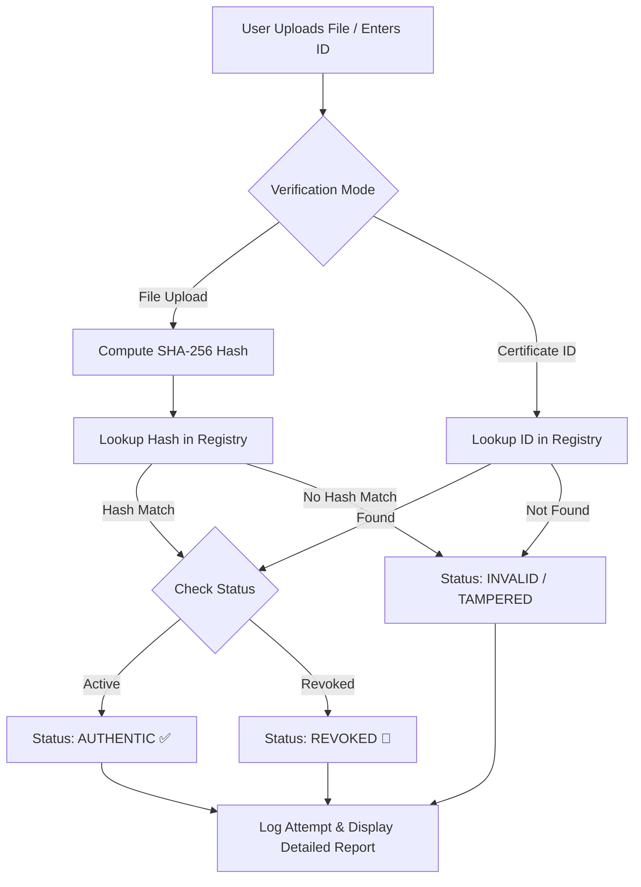

# 🛡️ CertValid — Certificate Verification & Management System

[](https://ranjithbrs.pythonanywhere.com)
[](https://github.com/ranjithbrs/CertValid)
[](LICENSE)

A modern, enterprise-ready **Flask-based** Certificate Verification & Management System. Supports cryptographic SHA-256 file tamper detection, Certificate ID lookup, scannable QR code generation, dynamic PNG certificate downloading, and a full Admin Management Dashboard with audit trail logging.

---

## 🔗 Live Application & Links

- 🌐 **Live Public Portal:** [ranjithbrs.pythonanywhere.com](https://ranjithbrs.pythonanywhere.com)
- 🔑 **Admin Dashboard:** [ranjithbrs.pythonanywhere.com/admin](https://ranjithbrs.pythonanywhere.com/admin)
- 🐙 **GitHub Repository:** [github.com/ranjithbrs/CertValid](https://github.com/ranjithbrs/CertValid)

---

## ✨ Features

- 🔐 **Cryptographic SHA-256 Tamper Detection** — Uploaded certificate files (JPG/PNG/PDF) have their SHA-256 hash computed and compared against the secure registry. Any byte-level alteration instantly triggers a **TAMPERED / INVALID** alert.
- 🔍 **Dual Verification Modes** — Verify certificates by **Drag-and-Drop File Upload** or **Certificate ID Search**.
- 📱 **Embedded QR Code Verification** — Every issued certificate includes a unique QR code. Scanning it opens a live verification page in the browser.
- 🎓 **Dynamic Certificate Image Generator** — Certificates are dynamically generated on-the-fly with custom typography, issue details, and embedded QR codes. High-resolution PNGs can be downloaded instantly.
- 🚫 **Revoke & Reactivate Control** — Administrators can instantly revoke fraudulent or compromised certificates or reactivate them.
- 📜 **Full Audit Logging** — Every verification request is logged with timestamp, computed hash, IP address, and verification status.
- 🎨 **Modern Dark Glassmorphism UI** — Built with clean HTML5 & CSS3 featuring glassmorphism cards, micro-animations, responsive tables, and custom status badges.

---

## 🧪 Sample Certificates for Live Testing

Try these test certificates on the [Live Site](https://ranjithbrs.pythonanywhere.com):

| Certificate ID | Recipient Name | Course | Status | Direct Verification Link |
|----------------|----------------|--------|--------|--------------------------|
| `CERT-2024-001` | Aisha Sharma | B.Tech Computer Science | ✅ **Authentic** | [Verify CERT-2024-001](https://ranjithbrs.pythonanywhere.com/verify/CERT-2024-001) |
| `CERT-2024-002` | Rahul Verma | MBA Finance | ✅ **Authentic** | [Verify CERT-2024-002](https://ranjithbrs.pythonanywhere.com/verify/CERT-2024-002) |
| `CERT-2023-099` | Priya Patel | M.Sc Data Science | 🚫 **Revoked** | [Verify CERT-2023-099](https://ranjithbrs.pythonanywhere.com/verify/CERT-2023-099) |

---

## 🔑 Default Admin Credentials

Access the Admin Panel at [ranjithbrs.pythonanywhere.com/admin](https://ranjithbrs.pythonanywhere.com/admin):

| Username | Password |
|----------|----------|
| `admin`  | `admin123` |

---

## 🚀 Quick Start (Local Setup)

### 1. Clone the repository
```bash
git clone https://github.com/ranjithbrs/CertValid.git
cd CertValid
```

### 2. Install dependencies
```bash
pip install -r requirements.txt
```

### 3. Initialize Database & Run
```bash
python app.py
```

Open your browser to:
- **Public Portal:** `http://127.0.0.1:5000`
- **Admin Dashboard:** `http://127.0.0.1:5000/admin`

---

## 🌐 Deploying to PythonAnywhere

1. **Clone repository on PythonAnywhere:**
   ```bash
   git clone https://github.com/ranjithbrs/CertValid.git
   cd CertValid
   pip install --user -r requirements.txt
   ```

2. **Initialize Database:**
   ```bash
   python -c "import db; db.init_db()"
   ```

3. **Configure Web App in PythonAnywhere Web Tab:**
   - Select **Python 3.10**
   - Point WSGI file to:
     ```python
     import sys, os
     project_home = '/home/<your-username>/CertValid'
     if project_home not in sys.path:
         sys.path.insert(0, project_home)
     from app import app as application
     ```
   - Set Static Files mapping: `/static/` → `/home/<your-username>/CertValid/static/`
   - Click **Reload**!

---

## 📁 Project Structure

```
CertValid/
├── app.py              # Flask app, routes, image generator & WSGI logic
├── db.py               # SQLite database layer, schema & CRUD helpers
├── database.db         # SQLite database file (auto-initialized)
├── wsgi.py             # WSGI entry point for production deployment
├── requirements.txt    # Python package dependencies
├── README.md           # Comprehensive project documentation
├── .gitignore          # Git exclusion rules
├── static/
│   ├── style.css       # Custom Glassmorphism CSS design system
│   ├── uploads/        # Temporary uploaded certificate files
│   └── certs/          # Generated certificate PNG images
└── templates/
    ├── upload.html     # Public verification portal (upload & ID search)
    ├── result.html     # Verification report & cryptographic audit view
    └── admin.html      # Admin dashboard, certificate issuer & audit logs
```

---

## 🔒 Verification Workflow Architecture



---

## 🛠️ Technology Stack

- **Backend:** Python 3, Flask
- **Database:** SQLite3
- **Image Processing & QR:** Pillow (PIL), `qrcode`
- **Frontend:** HTML5, Modern Vanilla CSS (Glassmorphism design system)
- **Security:** SHA-256 hashing, session authentication
- **Hosting:** PythonAnywhere

---

## 📄 License

This project is open-source and available under the [MIT License](LICENSE).
