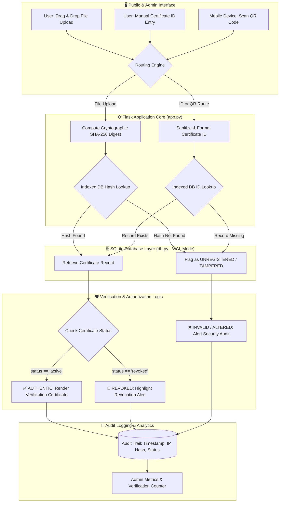

# 🛡️ CertValid — Certificate Verification & Management System

[](https://ranjithbrs.pythonanywhere.com)
[](https://flask.palletsprojects.com/)
[](https://www.sqlite.org/)
[](app.py)
[](LICENSE)

> A modern, enterprise-ready **Flask-based** Certificate Verification & Management System. Features cryptographic SHA-256 file tamper detection, instant Certificate ID lookup, scannable QR code generation, dynamic PNG certificate rendering with Pillow, salted PBKDF2-HMAC-SHA256 admin security, and an administrative dashboard with real-time audit trail logging.

---

## 🔗 Live Application & Portals

- 🌐 **Live Public Portal:** [ranjithbrs.pythonanywhere.com](https://ranjithbrs.pythonanywhere.com)
- 🔑 **Admin Management Dashboard:** [ranjithbrs.pythonanywhere.com/admin](https://ranjithbrs.pythonanywhere.com/admin)
- 🐙 **GitHub Repository:** [github.com/ranjithbrs/CertValid](https://github.com/ranjithbrs/CertValid)

---

## 📑 Table of Contents
- [Architecture & Verification Workflow](#-verification-workflow-architecture)
- [Key Features](#-key-features)
- [Live Test Certificates](#-sample-certificates-for-live-testing)
- [Admin Access](#-default-admin-credentials)
- [API & Route Specifications](#-api--route-specifications)
- [Local Setup & Development](#-quick-start-local-setup)
- [Deployment (PythonAnywhere)](#-deploying-to-pythonanywhere)
- [Project Structure](#-project-structure)
- [Technology Stack](#-technology-stack)
- [Author & Connect](#-author)
- [License](#-license)

---

## 🔒 Verification Workflow Architecture



---

## ✨ Key Features

- 🔐 **Cryptographic SHA-256 Tamper Detection** — Uploaded certificate files (JPG/PNG/PDF) have their SHA-256 hash computed and compared against the indexed database registry. Any byte-level alteration instantly triggers a **TAMPERED / INVALID** warning.
- 🛡️ **Salted PBKDF2 Password Security** — Admin credentials use `PBKDF2-HMAC-SHA256` (260,000 iterations + 16-byte random salt) with constant-time verification (`hmac.compare_digest`) to prevent timing attacks. Includes automatic migration for legacy credentials.
- 🔍 **Dual Verification Modes** — Verify certificates seamlessly by either **Drag-and-Drop File Upload** or direct **Certificate ID Search**.
- 📱 **Embedded Live-Domain QR Codes** — Every generated certificate incorporates a dynamic QR code pointing to the live verification route (`BASE_URL/verify/<cert_id>`). Scanning with any camera opens instant verification.
- 🎓 **Dynamic High-Resolution PNG Generator** — Programmatically stamps recipient names, course titles, dates, signatures, and QR codes onto professional templates using **Pillow (PIL)**.
- ⚡ **High-Performance SQLite in WAL Mode** — B-tree indexed `file_hash` ($O(1)$ lookups), Write-Ahead Logging (WAL) for concurrency, and aggregated single-query dashboard statistics.
- 🚫 **Instant Revocation & Reactivation** — Full administrative control to revoke compromised credentials or reactivate verified records with immediate cache invalidation.
- 📜 **Full Audit Logging** — Logs every verification attempt with precise timestamps, computed SHA-256 signatures, client IP addresses, and authentication outcomes.
- 🎨 **Modern Dark Glassmorphism UI** — Built with clean HTML5 & CSS3 featuring glassmorphic cards, micro-interactions, responsive data tables, and custom-styled 404/500 error pages.

---

## 🧪 Sample Certificates for Live Testing

Test the verification engine using these seeded records on the [Live Site](https://ranjithbrs.pythonanywhere.com):

| Certificate ID | Recipient Name | Course / Program | Status | Direct Live Verification Link |
| :--- | :--- | :--- | :--- | :--- |
| `CERT-2024-001` | Aisha Sharma | B.Tech Computer Science | ✅ **Authentic** | [Verify CERT-2024-001](https://ranjithbrs.pythonanywhere.com/verify/CERT-2024-001) |
| `CERT-2024-002` | Rahul Verma | MBA Finance | ✅ **Authentic** | [Verify CERT-2024-002](https://ranjithbrs.pythonanywhere.com/verify/CERT-2024-002) |
| `CERT-2023-099` | Priya Patel | M.Sc Data Science | 🚫 **Revoked** | [Verify CERT-2023-099](https://ranjithbrs.pythonanywhere.com/verify/CERT-2023-099) |

---

## 🔑 Default Admin Credentials

Access the Admin Dashboard at [ranjithbrs.pythonanywhere.com/admin](https://ranjithbrs.pythonanywhere.com/admin):

| Field | Default Value | Notes |
| :--- | :--- | :--- |
| **Username** | `admin` | Administrator login identifier |
| **Password** | `admin123` | Salted & hashed via PBKDF2-HMAC-SHA256 |

---

## 📡 API & Route Specifications

| Method | Endpoint | Description | Access |
| :--- | :--- | :--- | :--- |
| `GET` | `/` | Main public verification portal (file drag & drop + ID search) | Public |
| `POST` | `/verify` | Processes file uploads, calculates SHA-256, and returns audit result | Public |
| `GET` | `/verify/<cert_id>` | Direct URL lookup and target endpoint for scannable QR codes | Public |
| `GET` | `/download/<cert_id>` | Generates and serves dynamic high-res certificate PNG | Public |
| `GET` | `/admin` | Admin dashboard displaying statistics, audit logs, and issued certs | Admin Only |
| `POST` | `/admin/issue` | Issues a new certificate, creates hash, and stores record | Admin Only |
| `POST` | `/admin/revoke/<cert_id>` | Toggles certificate status between Active and Revoked | Admin Only |
| `POST` | `/admin/login` | Authenticates administrator with salted PBKDF2 password | Public |
| `GET` | `/admin/logout` | Terminates active admin session | Admin Only |

---

## 🚀 Quick Start (Local Setup)

### 1. Clone the repository
```bash
git clone https://github.com/ranjithbrs/CertValid.git
cd CertValid
```

### 2. Install dependencies
```bash
pip install -r requirements.txt
```

### 3. Initialize Database & Start Server
```bash
python app.py
```

Access the application in your browser:
- **Public Verification Portal:** `http://127.0.0.1:5000`
- **Admin Dashboard:** `http://127.0.0.1:5000/admin`

---

## ⚙️ Environment Variables (Optional)

| Variable | Description | Default Value |
| :--- | :--- | :--- |
| `BASE_URL` | Base URL embedded in generated QR codes | `https://ranjithbrs.pythonanywhere.com` |
| `SECRET_KEY` | Flask session encryption key | Auto-generated random 32-byte hex token |
| `FLASK_DEBUG` | Enable live debugger and hot reload | `false` |

---

## 🌐 Deploying to PythonAnywhere

1. **Clone repository on PythonAnywhere bash console:**
   ```bash
   git clone https://github.com/ranjithbrs/CertValid.git
   cd CertValid
   pip install --user -r requirements.txt
   ```

2. **Initialize SQLite Database:**
   ```bash
   python -c "import db; db.init_db()"
   ```

3. **Configure WSGI Configuration File (`/var/www/<username>_pythonanywhere_com_wsgi.py`):**
   ```python
   import sys, os
   project_home = '/home/<your-username>/CertValid'
   if project_home not in sys.path:
       sys.path.insert(0, project_home)
   from app import app as application
   ```

4. **Map Static Files:**
   - URL: `/static/`
   - Directory: `/home/<your-username>/CertValid/static/`

5. **Click Reload Web App.**

---

## 📁 Project Structure

```text
CertValid/
├── app.py              # Flask app, HTTP routes, dynamic Pillow image generator & error handlers
├── db.py               # SQLite database layer, WAL mode, SHA-256 indexing & PBKDF2 auth
├── database.db         # SQLite database file (auto-initialized on startup)
├── wsgi.py             # WSGI entrypoint for production hosting
├── requirements.txt    # Python package dependencies
├── README.md           # Comprehensive project documentation
├── .gitignore          # Git exclusion rules
├── static/
│   ├── style.css       # Custom Glassmorphism CSS design system
│   ├── uploads/        # Temporary uploaded certificate files (auto-cleaned)
│   └── certs/          # Generated certificate PNG images
└── templates/
    ├── upload.html     # Public verification portal (upload & ID search)
    ├── result.html     # Verification report & cryptographic audit view
    ├── admin.html      # Admin dashboard, certificate issuer & audit logs
    └── error.html      # Styled 404 / 500 error pages
```

---

## 🛠️ Technology Stack

- **Backend:** Python 3, Flask, WSGI
- **Database:** SQLite3 (WAL mode, indexed file hashes)
- **Cryptography & Security:** SHA-256 hashing, PBKDF2-HMAC-SHA256 password security, `hmac.compare_digest`
- **Image Generation:** Pillow (PIL), `qrcode`, NumPy
- **Frontend:** HTML5, Modern CSS3 (Glassmorphism design system)
- **Deployment:** PythonAnywhere PaaS

---

## 👨‍💻 Author

**Ranjith B**  
🎓 *B.Tech Computer Science & Business Systems (CSBS)*  
🏛️ *Nehru Institute of Engineering and Technology, Coimbatore*  

- 💼 **LinkedIn**: [linkedin.com/in/ranjith-b-85907831a](https://linkedin.com/in/ranjith-b-85907831a)  
- 🐙 **GitHub**: [github.com/ranjithbrs](https://github.com/ranjithbrs)  
- 🌐 **Portfolio**: [ranjithbrs.github.io/portfolio](https://ranjithbrs.github.io/portfolio/)  
- 📧 **Email**: ranjithb2k06@gmail.com  

---

## 📄 License

This project is open-source and available under the [MIT License](LICENSE).
