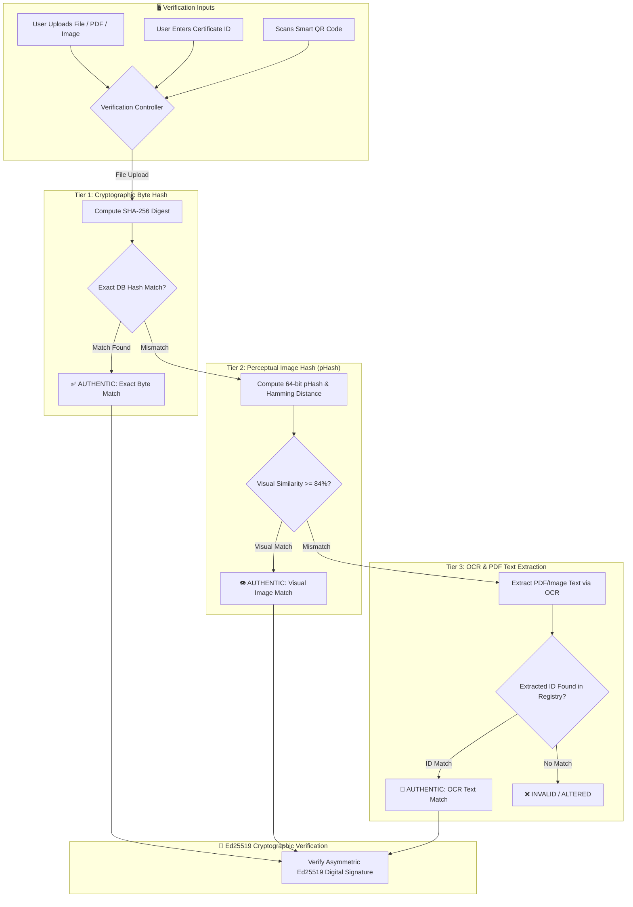

# 🛡️ CertValid — Smart Certificate Verification & Management System

> **Say goodbye to fake degrees and altered certificates.**  
> CertValid is a modern, tamper-proof credential verification platform built for universities, employers, and students. Verify any certificate or academic transcript in under 2 seconds.

[](https://ranjithbrs.pythonanywhere.com)
[](https://flask.palletsprojects.com/)
[](https://ranjithbrs.pythonanywhere.com)
[](https://www.sqlalchemy.org/)
[](LICENSE)

---

## 🔗 Quick Links (Try It Live Right Now)

- 🌐 **Public Verification Portal:** [ranjithbrs.pythonanywhere.com](https://ranjithbrs.pythonanywhere.com)
- 📜 **Sample Academic Transcript:** [ranjithbrs.pythonanywhere.com/transcript/TR-2024-001](https://ranjithbrs.pythonanywhere.com/transcript/TR-2024-001)
- 🔑 **Admin Portal:** [ranjithbrs.pythonanywhere.com/admin](https://ranjithbrs.pythonanywhere.com/admin) *(Username: `admin` | Password: `admin123`)*
- 🐙 **GitHub Repository:** [github.com/ranjithbrs/CertValid](https://github.com/ranjithbrs/CertValid)

---

## 💡 What is CertValid in 30 Seconds?

Think of **CertValid** like a **digital passport for certificates and degrees**.

Just like an airline boarding pass or passport has a scannable digital barcode that airport security scans to confirm your identity, CertValid gives every issued certificate a **tamper-proof digital seal** and a **unique verification code**.

Anyone &mdash; an HR manager, recruiter, university admissions officer, or student &mdash; can open the website, enter the certificate ID or scan the QR code with their phone, and instantly see:
- ✅ **Who** the certificate was issued to
- 🏫 **Which institution** issued it
- 📅 **When** it was issued and if it is still valid
- 🔒 **Proof** that not a single word, grade, or image has been altered

No phone calls, no emailing universities, no waiting 2 weeks for a background check. **Instant verification in 2 seconds.**

---

## ⚠️ The Real-World Problem & How CertValid Solves It

```
❌ The Old Way:
Candidate applies ➡️ Submits PDF certificate ➡️ Recruiter emails university ➡️ Waits 2–3 weeks ➡️ Expensive & slow

✅ The CertValid Way:
Candidate applies ➡️ Recruiter scans QR code or types ID ➡️ Instant authentic badge with official records in 2 seconds!
```

- **The Problem:** Credential fraud is at an all-time high. With basic tools like Photoshop or online PDF editors, anyone can change a name, degree, or grade on a certificate. Companies lose thousands hiring unqualified candidates, and legitimate students have their hard-earned achievements devalued.
- **The Solution:** CertValid acts as an unalterable single source of truth. Every document is mathematically sealed. If someone alters even a single letter, changes a grade, or swaps a name, the system immediately rejects it as fake.

---

## 👥 Who is CertValid Built For?

### 🎓 1. For Students & Job Seekers
- **Showcase Authentic Achievements:** Share a verified link directly with hiring managers.
- **Add to LinkedIn with 1-Click:** Directly attach your verified credential to your LinkedIn profile.
- **Live Embeddable Badges:** Embed an interactive "Verified Credential" badge on your personal portfolio website.
- **All-in-One Academic Transcripts:** Combine multiple semester certificates into one clean, official degree transcript.

### 🏢 2. For Employers & Recruiters
- **Zero Waiting Time:** Verify candidates' degrees during an interview in 2 seconds.
- **Automatic Fraud Detection:** Drag and drop an applicant's PDF or image &mdash; CertValid checks if it matches the genuine record.
- **Free & Easy:** No specialized hardware or software needed &mdash; works on any computer or mobile browser.

### 🏫 3. For Universities, Schools & Training Academies
- **Issue Hundreds at Once:** Upload a simple Excel or CSV file to generate and issue hundreds of graduation certificates in seconds.
- **Official Print-Ready PDFs:** Automatically generates vector PDF certificates and multi-course transcripts with official seals and QR codes.
- **Full Control:** Instantly revoke or reactivate certificates if necessary, with automated security logging.
- **Custom Institutional Branding:** Choose from 5 luxury certificate themes (Gold, Emerald, Navy, Crimson, Midnight) to match your school colors.

---

## 🧪 Try It Yourself (Live Test Examples)

You can test the verification engine right now using these seeded records on the [Live Site](https://ranjithbrs.pythonanywhere.com):

| Document Type | ID Code | Recipient | Course / Program | Status | Test Link |
| :--- | :--- | :--- | :--- | :--- | :--- |
| **Individual Certificate** | `CERT-2024-001` | Aisha Sharma | B.Tech Computer Science | ✅ **Authentic** | [👉 Test CERT-2024-001](https://ranjithbrs.pythonanywhere.com/verify/CERT-2024-001) |
| **Individual Certificate** | `CERT-2024-002` | Rahul Verma | MBA Finance | ✅ **Authentic** | [👉 Test CERT-2024-002](https://ranjithbrs.pythonanywhere.com/verify/CERT-2024-002) |
| **Revoked Certificate** | `CERT-2023-099` | Priya Patel | M.Sc Data Science | 🚫 **Revoked** | [👉 Test CERT-2023-099](https://ranjithbrs.pythonanywhere.com/verify/CERT-2023-099) |
| **Academic Transcript Bundle** | `TR-2024-001` | Aisha Sharma | B.Tech CS & Cloud Architecture | 📜 **Verified Bundle** | [👉 Test Transcript TR-2024-001](https://ranjithbrs.pythonanywhere.com/transcript/TR-2024-001) |

> 💡 **Tip:** On the homepage search bar, try typing `TR-2024-001` directly &mdash; notice how the smart search bar automatically detects it's an academic transcript and routes you straight to the full transcript!

---

## 🌟 Key Features Made Simple

```
┌────────────────────────────────────────────────────────────────────────┐
│                        ✨ WHAT YOU CAN DO WITH CERTVALID                │
├──────────────────────────┬─────────────────────────┬───────────────────┤
│  🔍 3-Way Verification   │  📜 Academic Transcripts│  💼 LinkedIn Ready│
│  Type ID, scan QR code,  │  Bundle multi-semester  │  1-click add to   │
│  or upload image / PDF.  │  certificates into one. │  LinkedIn profile.│
├──────────────────────────┼─────────────────────────┼───────────────────┤
│  📁 Bulk CSV Issuance    │  🖨️ Vector PDF Engine    │  🎨 5 Design Themes│
│  Issue 500 certificates  │  Download crystal-clear │  Gold, Navy,      │
│  with one Excel upload.  │  printable documents.   │  Emerald & more.  │
├──────────────────────────┼─────────────────────────┼───────────────────┤
│  🔒 Bank-Grade Security  │  📊 Visual Analytics    │  📱 Smartphone QR │
│  Cannot be forged,       │  See verification       │  Scan with any    │
│  hacked, or photoshopped.│  trends on charts.      │  camera app.      │
└──────────────────────────┴─────────────────────────┴───────────────────┘
```

1. **3-Way Flexible Verification:**
   - **By ID:** Type any certificate or transcript ID into the search bar.
   - **By QR Code:** Point your smartphone camera at the certificate's QR code.
   - **By File Upload:** Upload a certificate file (PNG, JPG, or PDF) to verify its authenticity.
2. **Multi-Credential Academic Transcripts:**
   - Issue full degree transcripts that bundle multiple individual certificates (e.g., Year 1, Year 2, Capstone Project) into a single verifiable master document.
3. **Smart Fake-Detection (Catches Even Subtle Edits):**
   - **Exact Match:** Compares the uploaded file's digital fingerprint.
   - **Visual Scanner:** Even if the image was resized, converted to JPG, or compressed on WhatsApp, our visual recognition engine still confirms if it's the authentic original.
   - **OCR Text Reader:** Automatically reads text inside PDFs and scanned documents to match official university records.
4. **Professional Share & Embed Tools:**
   - **LinkedIn Integration:** Candidates can add verified credentials to their LinkedIn profile with one click.
   - **Interactive Website Embeds:** Students and developers can embed a live verification badge directly onto their portfolio site or resume.
   - **Social Preview Cards:** When shared on Twitter, LinkedIn, or messaging apps, rich 1200&times;630 preview cards are automatically displayed.
5. **Admin Management Suite:**
   - **Bulk Issuance:** Upload an Excel/CSV file to generate and package certificates into a downloadable ZIP in seconds.
   - **Visual Analytics:** Interactive graphs show verification activity, popular courses, and security trends.
   - **Granular Access (RBAC):** Separate permissions for Superadmins, Certificate Issuers, and Auditors.
   - **Two-Factor Authentication (2FA):** Protect admin access with Google Authenticator or Microsoft Authenticator.

---

## 🔑 Admin Portal Demo Credentials

Want to test how administrators issue and manage certificates?  
Log in at [ranjithbrs.pythonanywhere.com/admin](https://ranjithbrs.pythonanywhere.com/admin):

| Credential | Value |
| :--- | :--- |
| **Username** | `admin` |
| **Password** | `admin123` |
| **Role** | Super Administrator (Full Management Access) |

---

## 💻 For Developers & Technical Teams

<details>
<summary><b>🛠️ Click to expand Technical Architecture, REST API & Local Setup Guide</b></summary>

### 🏗️ How the Multi-Layer Verification Engine Works


```mermaid
flowchart TD
    subgraph Client["🖥️ Verification Inputs"]
        A[User Uploads File / PDF / Image] --> C{Verification Controller}
        B[User Enters Certificate ID] --> C
        QR[Scans Smart QR Code] --> C
    end

    subgraph Tier1["Tier 1: Cryptographic Byte Hash"]
        C -->|File Upload| D[Compute SHA-256 Digest]
        D --> E{Exact DB Hash Match?}
        E -->|Match Found| OK[✅ AUTHENTIC: Exact Byte Match]
    end

    subgraph Tier2["Tier 2: Perceptual Image Hash (pHash)"]
        E -->|Mismatch| F[Compute 64-bit pHash & Hamming Distance]
        F --> G{Visual Similarity >= 84%?}
        G -->|Visual Match| OK2[👁️ AUTHENTIC: Visual Image Match]
    end

    subgraph Tier3["Tier 3: OCR & PDF Text Extraction"]
        G -->|Mismatch| H[Extract PDF/Image Text via OCR]
        H --> I{Extracted ID Found in Registry?}
        I -->|ID Match| OK3[📄 AUTHENTIC: OCR Text Match]
        I -->|No Match| FAIL[❌ INVALID / ALTERED]
    end

    subgraph CryptoSign["🔏 Ed25519 Cryptographic Verification"]
        OK --> V[Verify Asymmetric Ed25519 Digital Signature]
        OK2 --> V
        OK3 --> V
    end
```

### 🧰 Technology Stack

- **Backend Framework:** Python 3, Flask, SQLAlchemy ORM, WSGI
- **Database Abstraction:** SQLite3 (WAL mode) / PostgreSQL / MySQL (via `DATABASE_URL`)
- **Cryptography & Signatures:** Ed25519 Elliptic Curve Signatures, SHA-256, PBKDF2-HMAC-SHA256 (260,000 iterations + 16-byte salt)
- **Computer Vision & Document Processing:** Pillow, `imagehash`, `pypdf`, `pytesseract`, `qrcode`, `reportlab`
- **Security & Infrastructure:** Flask-Limiter (Rate Limiting), TOTP 2FA (`pyotp`), AWS S3 (`boto3`)
- **Frontend UI:** Responsive Glassmorphism Design, Chart.js, Vanilla CSS3, SVG vector badges

### ⚡ RESTful API Reference (v1)

CertValid provides a clean REST API for automated integrations:

| Method | Endpoint | Description |
| :--- | :--- | :--- |
| `GET` | `/api/v1/health` | System health check and database statistics |
| `GET` | `/api/v1/analytics` | 30-day verification statistics and trends |
| `POST` | `/api/v1/verify/id` | Verify credential by ID (`{"cert_id": "CERT-2024-001"}`) |
| `POST` | `/api/v1/verify/file` | Verify credential by uploading file multipart |
| `POST` | `/api/v1/issue` | Programmatically issue certificate (requires API key) |
| `GET` | `/api/v1/transcript/<bundle_id>` | Retrieve full transcript data and course records |

### 🚀 Quick Local Setup (Run on Your Computer)

#### 1. Clone the repository
```bash
git clone https://github.com/ranjithbrs/CertValid.git
cd CertValid
```

#### 2. Install dependencies
```bash
pip install -r requirements.txt
```

#### 3. Start the application
```bash
python app.py
```

Open your browser at:
- **Public Portal:** `http://127.0.0.1:5000`
- **Admin Dashboard:** `http://127.0.0.1:5000/admin`

</details>

---

## 👨‍💻 Project Creator

**Ranjith B**  
🎓 *B.Tech Computer Science & Business Systems (CSBS)*  
🏛️ *Nehru Institute of Engineering and Technology, Coimbatore*  
- 💼 **LinkedIn:** [linkedin.com/in/ranjith-b-csbs23](https://linkedin.com/in/ranjith-b-csbs23)  
- 🐙 **GitHub:** [github.com/ranjithbrs](https://github.com/ranjithbrs)  
- 🌐 **Portfolio:** [ranjithbrs.github.io/portfolio](https://ranjithbrs.github.io/portfolio/)  
- 📧 **Email:** ranjithb2k06@gmail.com  

---

## 📄 License

This project is licensed under the [MIT License](LICENSE) &mdash; feel free to use, modify, and build upon it!
